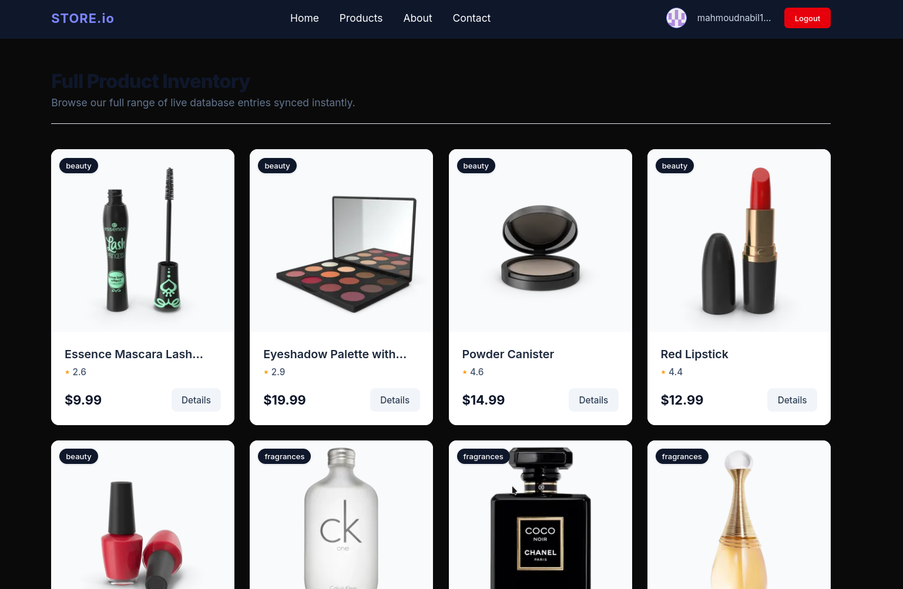
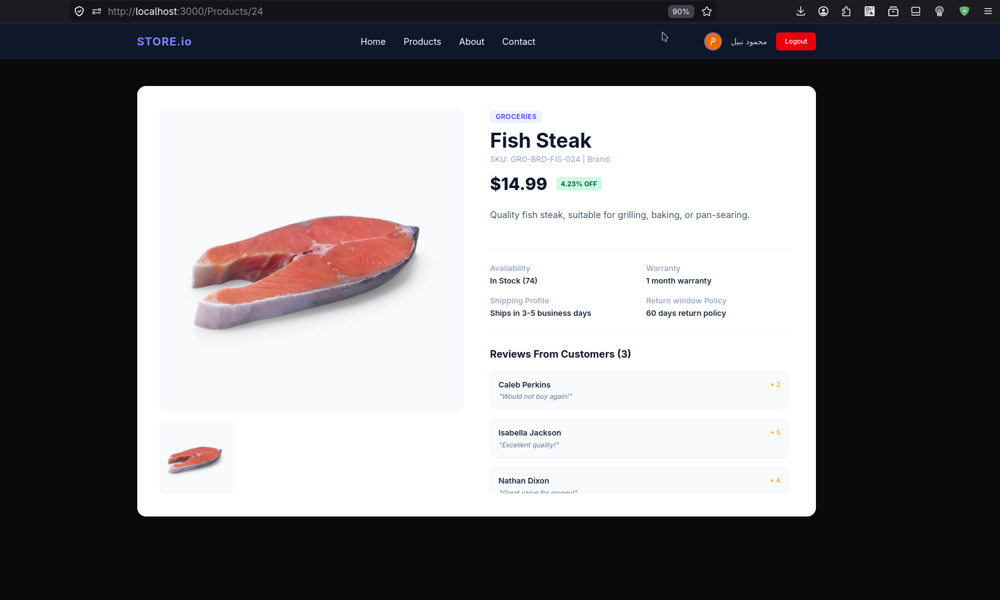

# Products App

A modern Products Application built with **Next.js 16 App Router**, **TypeScript**, **Tailwind CSS v4**, **MongoDB Atlas**, **Mongoose**, and **NextAuth**.

The application allows users to browse products, view product details, and authenticate using GitHub or Google.

---

## Features

- **Next.js 16 App Router** (hybrid SSR/Client architecture)
- **TypeScript** full type safety
- **Tailwind CSS v4** styling
- **MongoDB Atlas** database connection
- **Mongoose ODM** schema & models
- **NextAuth Authentication** (GitHub & Google Login)
- **Full CRUD Management**:
  - Add products with pre-filled default schema properties.
  - Edit products using a beautiful modal.
  - Delete products with confirmation security.
- **Product Listing Page** with real-time reactive Search and Category Filtering.
- **Product Details Page** dynamic SSR fetching.
- **Responsive Navigation Bar** with session display.

---

## Screenshots

### Products Page



---

### Product Details Page



---

## Tech Stack

| Technology | Purpose |
|------------|----------|
| Next.js 16 | React Framework |
| React 19 | UI Library |
| TypeScript | Type Safety |
| Tailwind CSS v4 | Styling |
| MongoDB Atlas | Database |
| Mongoose | ODM |
| NextAuth | Authentication |

---

## Project Structure

```text
src
├── app
│   ├── page.tsx
│   ├── layout.tsx
│   │
│   ├── products
│   │   ├── page.tsx
│   │   └── [id]
│   │       └── page.tsx
│   │
│   ├── about
│   │   └── page.tsx
│   │
│   ├── contact
│   │   └── page.tsx
│   │
│   └── api
│       ├── products
│       │   ├── route.ts
│       │   └── [id]
│       │       └── route.ts
│       │
│       └── auth
│           └── [...nextauth]
│               └── route.ts
│
├── components
│   ├── Navbar.tsx
│   ├── ProductCard.tsx
│   ├── ProductDetails.tsx
│   └── Providers.tsx
│
├── lib
│   ├── db.ts
│   └── auth.ts
│
├── models
│   └── Product.ts
│
├── types
│   └── Product.ts
│
└── docs
    ├── all.png
    └── details.png
```

---

## Routes

### Pages

| Route | Description |
|---------|------------|
| `/` | Home Page |
| `/products` | Products Listing |
| `/products/[id]` | Product Details |
| `/about` | About Page |
| `/contact` | Contact Page |

### API Routes

| Method | Endpoint | Description |
|--------|----------|-------------|
| `GET` | `/api/products` | Retrieve all products |
| `POST` | `/api/products` | Create a new product (auto-increments ID) |
| `GET` | `/api/products/[id]` | Retrieve a single product by numeric ID |
| `PUT` | `/api/products/[id]` | Update a product by numeric ID |
| `DELETE` | `/api/products/[id]` | Delete a product by numeric ID |

#### Create Product

```http
POST /api/products
Content-Type: application/json
```

Request Body:
```json
{
  "title": "iPhone 15 Pro Max",
  "brand": "Apple",
  "category": "smartphones",
  "price": 1199.99,
  "discountPercentage": 5.5,
  "stock": 42,
  "thumbnail": "https://example.com/iphone15.jpg",
  "description": "The latest Apple flagship smartphone."
}
```

#### Update Product

```http
PUT /api/products/1
Content-Type: application/json
```

Request Body (any subset of fields):
```json
{
  "price": 1099.99,
  "stock": 35
}
```

#### Delete Product

```http
DELETE /api/products/1
```

---

## Product Schema

```ts
interface Product {
  id: number;
  title: string;
  description: string;
  category: string;
  price: number;
  discountPercentage: number;
  rating: number;
  stock: number;

  tags: string[];

  brand: string;
  sku: string;
  weight: number;

  dimensions: {
    width: number;
    height: number;
    depth: number;
  };

  warrantyInformation: string;
  shippingInformation: string;
  availabilityStatus: string;

  reviews: {
    rating: number;
    comment: string;
    date: string;
    reviewerName: string;
    reviewerEmail: string;
  }[];

  returnPolicy: string;

  minimumOrderQuantity: number;

  meta: {
    createdAt: string;
    updatedAt: string;
    barcode: string;
    qrCode: string;
  };

  images: string[];

  thumbnail: string;
}
```

---

## Environment Variables

Create a `.env.local` file:

```env
MONGODB_URI=your_mongodb_connection

NEXTAUTH_SECRET=your_secret
NEXTAUTH_URL=http://localhost:3000

GITHUB_CLIENT_ID=your_github_client_id
GITHUB_CLIENT_SECRET=your_github_client_secret

GOOGLE_CLIENT_ID=your_google_client_id
GOOGLE_CLIENT_SECRET=your_google_client_secret
```

---

## Installation

Clone the repository:

```bash
git clone <repository-url>
```

Move into the project:

```bash
cd demo
```

Install dependencies:

```bash
npm install
```

---

## Run Development Server

```bash
npm run dev
```

Open your browser and visit:

```text
http://localhost:3000
```

---

## Build for Production

```bash
npm run build
```

Start the production server:

```bash
npm run start
```

---

## Authentication

The application uses **NextAuth** with:

- GitHub Provider
- Google Provider

Features:

- Secure Login
- Logout
- Session Management
- User Authentication

---

## Database

MongoDB Atlas is used as the primary database.

Responsibilities:

- Store Products
- Retrieve Products
- Retrieve Product Details

---

## Future Improvements

- Pagination
- Wishlist
- User Profiles
- Enhanced Admin Role Guards (Session-based UI restrictions)

---

## Author

**Mahmoud Nabil**

- GitHub: https://github.com/mahmoudnabil133
- LinkedIn: https://www.linkedin.com/in/mahmoud-nabil-97278b24b/

---

## License

MIT License